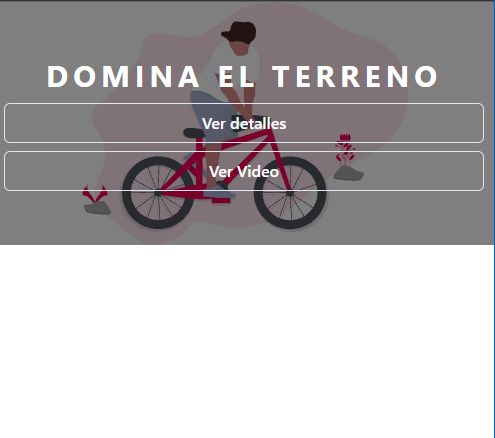

# mini proyecto para apreder chakra-ui

[Chakra-ui](https://chakra-ui.com/):
Chakra UI is a simple, modular and accessible component library that gives you the building blocks you need to build your React applications.

#### diseño para tablet

#### diseño para movil

